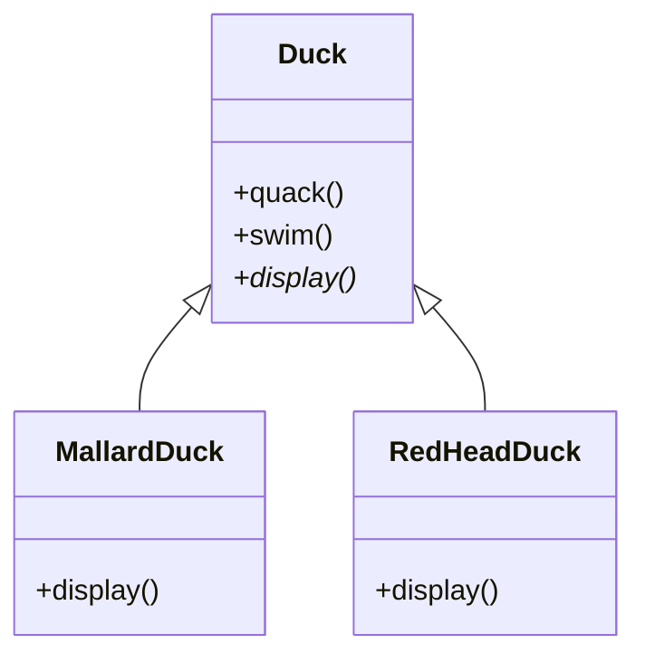
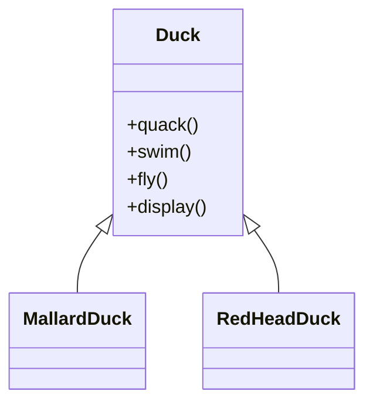
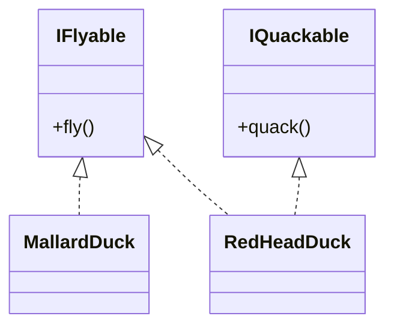
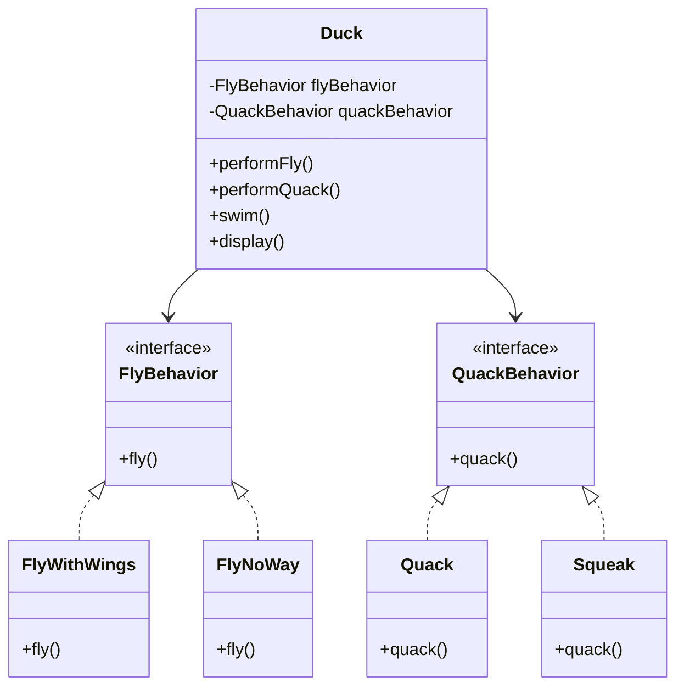

# Why Do We Need Design Patterns?

Many problems in software engineering repeat across different systems. Often, someone has already solved a similar problem and documented a **reusable solution**. These reusable solutions are called **Design Patterns**.

A **Design Pattern** is not code that you copy-paste directly into your project.  
Instead, it is a **proven blueprint** for solving a common design problem.

---

# Example Scenario

Consider a company that has an application called **SimUDuck**.  
This application simulates different types of ducks.

All ducks share some common behaviors:

- `quack()`
- `swim()`
- `display()`

The `display()` method is **virtual** because each duck has a different appearance.

---

# Initial Design



- `Duck` is the base class.
- `MallardDuck` and `RedHeadDuck` inherit from it.
- They override the `display()` method.

This design works well for the initial requirements.

---

# New Requirement

A new requirement arrives:

> Ducks should now be able to **fly**.

An engineer modifies the base class and adds a `fly()` method.

---

# Modified Design



Because all ducks inherit from `Duck`, they automatically gain the `fly()` behavior.

---

# The Problem

Not all ducks can fly.

Examples:

- **RubberDuck**
- **DecoyDuck**

These ducks **should not have flying behavior**.

However, because `fly()` is defined in the base class, all subclasses inherit it.  
This results in incorrect behavior.

Example:

```
RubberDuck.fly() ❌
```

One workaround would be overriding `fly()` in these subclasses and making it do nothing, but that leads to messy code and poor design.

---

# Attempted Solution: Interfaces

Another idea is to use interfaces.



Each duck implements interfaces depending on its behavior.

For example:

- `MallardDuck` implements `IFlyable`
- `RedHeadDuck` implements `IFlyable` and `IQuackable`

---

# Why This Is Still a Problem

Although this looks flexible, it introduces another issue.

### Code Duplication

If 48 duck subclasses implement `IFlyable`, each class must implement its own `fly()` method.

If we later change the flying behavior, we must modify **all 48 classes**.

This leads to:

- Duplicate code
- Hard maintenance
- Higher chances of bugs

Whenever behavior changes, developers must **track down every subclass where the behavior exists**.

---

# Key Observation

Some parts of the system **change frequently**:

- Flying behavior
- Quacking behavior

Other parts remain stable:

- Duck identity
- Swimming behavior

A core design principle emerges:

> **Take what varies and encapsulate it so it won’t affect the rest of your code.**

---

# Design Pattern Solution

Instead of implementing behaviors directly in duck classes, we **extract behaviors into separate classes**.

This approach follows the **Strategy Design Pattern**.

---

# Final Design (Strategy Pattern)



Now:

- `Duck` **has behaviors instead of implementing them directly**.
- Behaviors are **encapsulated into separate classes**.
- Multiple ducks can reuse the same behavior implementation.

Example configurations:

- `MallardDuck` → `FlyWithWings`
- `RubberDuck` → `FlyNoWay`
- `RubberDuck` → `Squeak`

---

# Benefits of This Approach

- Eliminates code duplication  
- Behaviors are reusable  
- Easy to modify behaviors  
- Follows composition over inheritance  
- Highly flexible and scalable

---

# Key Design Principle

> **Favor composition over inheritance.**

Instead of inheriting behavior, compose objects with behavior implementations.