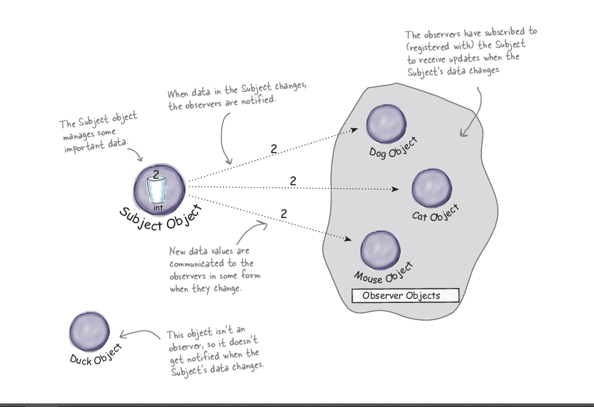
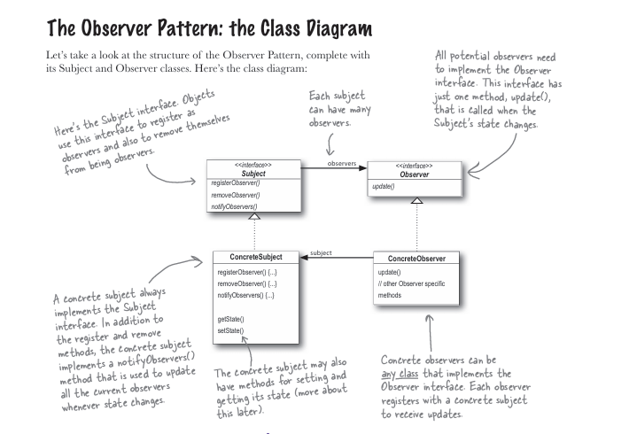

# Observer Pattern

You don’t want to miss out when something interesting happens, do you?  

Sometimes an object needs to know when **another object changes its state**. Instead of constantly checking (polling), we want a mechanism where interested objects are **automatically notified** when something changes.

This is exactly what the **Observer Pattern** solves.

---

# Publisher + Subscribers = Observer Pattern

If you understand **newspaper subscriptions**, you already understand the **Observer Pattern**.

- The **publisher** produces the newspaper.
- The **subscribers** receive updates whenever a new edition is available.

In design pattern terminology:

| Real World | Design Pattern |
|-------------|---------------|
| Publisher | **Subject** |
| Subscribers | **Observers** |

The **Subject** maintains a list of observers and **notifies them whenever its state changes**.



---

# Five-Minute Drama: A Subject for Observation

To better understand the Observer Pattern, let’s look at a short story involving a **headhunter and job seekers**.

### Scene 1

**Lori** approaches a headhunter.

> Lori:  
> *"I’m looking for a Java development position. I’ve got five years of experience..."*

**Headhunter replies:**

> *"Yeah, yeah... I’ll put you on my list of Java developers. Don’t call me, I’ll call you!"*

At this moment:

- The **headhunter becomes the Subject**
- Lori becomes an **Observer**

---

### Scene 2

**Jill** also approaches the headhunter.

> Jill:  
> *"Hi, I’ve written a lot of enterprise systems. I’m interested in any Java development jobs."*

The headhunter replies:

> *"Sure, I’ll add you to the list. You’ll know along with everyone else."*

Now the **subject has two observers**:

- Lori
- Jill

---

### Scene 3

Time passes...

Suddenly a Java job opening appears!

The headhunter announces:

> "Hey observers, there’s a Java opening down at JavaBeans-R-Us!  
> Jump on it before someone else does!"

Both **Lori and Jill receive the notification automatically**.

This is exactly how the **Observer Pattern works**.

---

### Scene 4

Jill quickly applies for the job and gets it.

She calls the headhunter and says:

> "You can remove me from your call list. I’ve found my own job."

Now Jill is **no longer an observer**.

The subject updates its observer list.

---

### Scene 5

Two weeks later...

Jill is enjoying her new job and her signing bonus.

But what about Lori?

Lori is now doing something interesting:

- She is **still observing the headhunter**
- But she also created **her own list of job seekers**

Now Lori is:

- **An Observer** (of the headhunter)
- **A Subject** (to her own observers)

This shows that in real systems, **an object can be both a subject and an observer at the same time**.

---

# Definition

The **Observer Pattern** defines a **one-to-many dependency** between objects so that when **one object changes state**, all of its dependents are **notified and updated automatically**.

Key idea:

> When the **Subject changes**, all **Observers are notified automatically**.

---

# Class Diagram

The Observer Pattern usually contains four main components:

1. **Subject**
2. **Observer**
3. **ConcreteSubject**
4. **ConcreteObserver**

The relationship looks like this:



---

# Key Responsibilities

### Subject

- Maintains a list of observers
- Provides methods to:
  - `registerObserver()`
  - `removeObserver()`
  - `notifyObservers()`

---

### Observer

- Defines an interface for receiving updates

Example:

```cpp
update()
```

---

### ConcreteSubject

- Stores the actual state
- Notifies observers when the state changes

---

### ConcreteObserver

- Implements the observer interface
- Updates itself when notified

---

# Why Use the Observer Pattern?

The Observer Pattern helps us:

✔ Decouple objects  
✔ Avoid tight dependencies  
✔ Build event-driven systems  
✔ Automatically notify dependent objects  

It is widely used in:

- **Event systems**
- **GUI frameworks**
- **Message brokers**
- **Stock market trackers**
- **Reactive programming**

---

# Real-World Examples

Examples of Observer Pattern in real systems:

- **YouTube channel subscriptions**
- **Twitter followers**
- **Stock price alerts**
- **Weather monitoring systems**
- **GUI button click listeners**

Whenever something **changes in one object** and **many objects must react**, the **Observer Pattern** is a great solution.